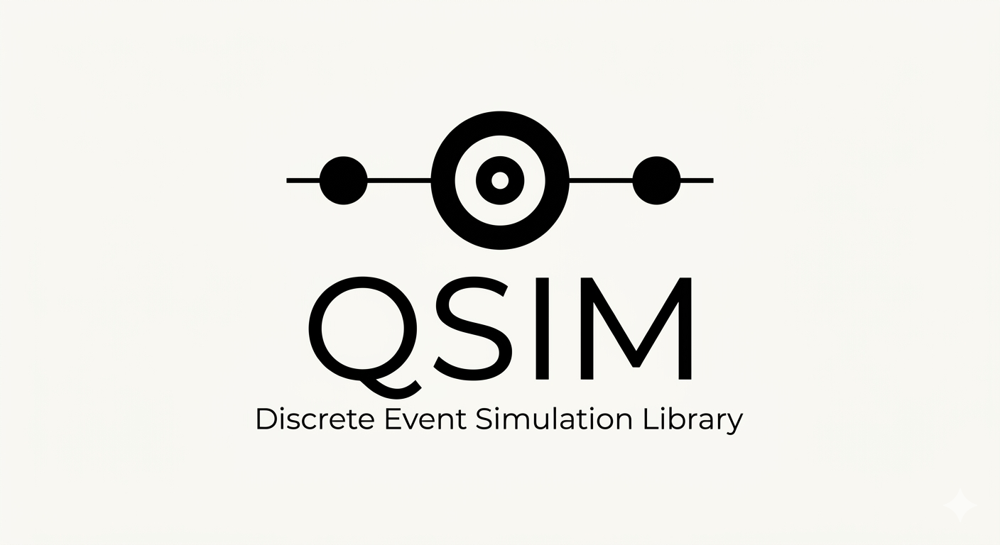

QSIM is an educational discrete-event simulation engine written in C11.

The project explores virtual clocks, event scheduling, stochastic modeling, and queueing systems through a modular simulation architecture. The current model included in the repository is an M/M/1 queue.
## Features

- Future Event List implemented as a binary min-heap
    
- Virtual simulation clock
    
- Event scheduling, cancellation, and rescheduling
    
- Context API separating engine and model code
    
- xoshiro256** pseudo-random number generator
    
- Exponential, Deterministic, and Erlang distributions
    
- Online statistical accumulators
    
- M/M/1 queue simulation
    
- Unit tests
    

## Project Structure

```text
engine/
    fel
    clock
    kernel
    context
    dispatch

stoch/
    prng
    dist

model/
    entity
    entity_queue
    mm1_handlers
    mm1_init

stats/
    time_acc
    sample_acc
    mm1_report
```

## Build

```bash
make
```

Run tests:

```bash
make test
```

Clean build artifacts:

```bash
make clean
```

## Example

```c
#include <stdio.h>
#include "mm1_init.h"
#include "mm1_report.h"

int main(void)
{
    MM1_Config cfg = {
        .arrival_mean = 2.0,
        .service_mean = 1.0,
        .seed = 42
    };

    mm1_init(cfg);

    mm1_run(10000.0);

    MM1_Report rep = mm1_generate_report();
    mm1_print_report(&rep);

    return 0;
}
```

Example output:

```text
=== M/M/1 Simulation Report ===
Arrivals            : 4950
Completions         : 4948
Max Queue Length    : 13
lambda_hat          : 0.494848
rho_hat             : 0.501740
Lq_hat              : 0.526949
L_hat               : 1.028689
Wq_hat              : 1.064772  (SE 0.026590)
W_hat               : 2.078590  (SE 0.030393)
================================
```

## Contributing

Bug reports, corrections, discussions, and pull requests are welcome.

## License

This project is released into the public domain.

You may use, modify, distribute, or incorporate the code into other projects without restriction.
